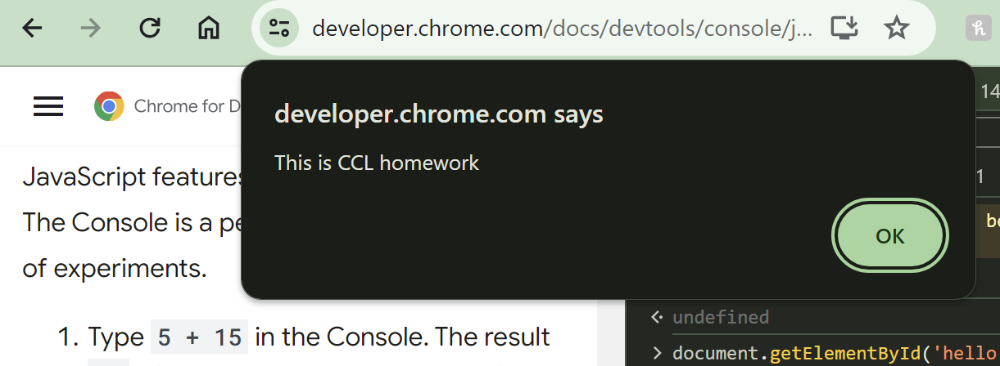
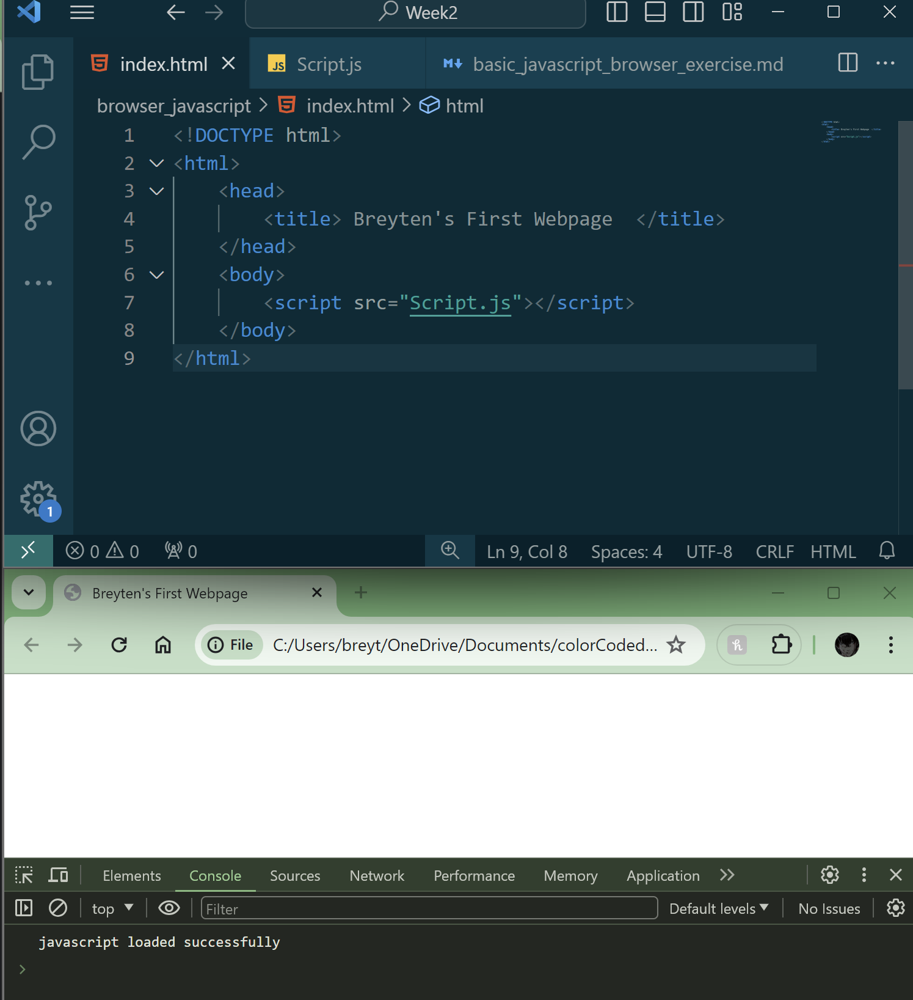
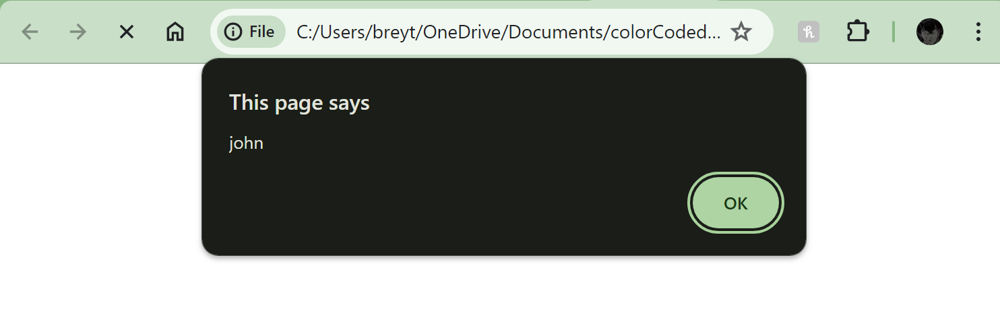
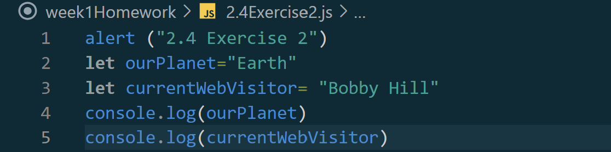
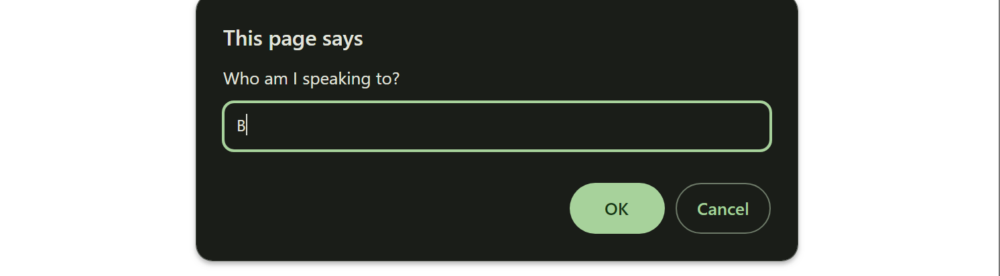
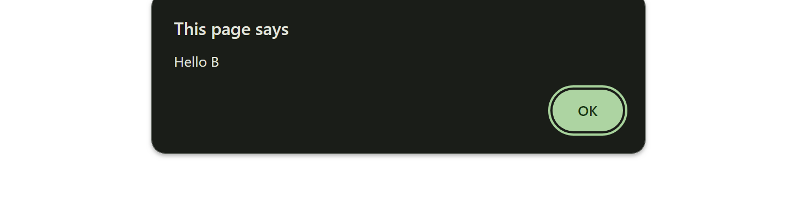

# Week 1 Homework 2.1-2.13
## (https://javascript.info/)

### 2.1 "hello World!"
Internal

alert("This is CCL homework")



External




### 2.4 "Variables"
#### Exercise 1



#### Exercise 2



#### Exercise 3

    It would make the most sense to uppercase const BIRTHDAY, becasue that persons birthday will alwasy be that day, month, year, where their age changes every year. I would challenge the idea of making age a constant variable.
 
 ### 2.5 "Data Types"

```Javascript
//Given
let name = "Ilya";
//Outputs
    alert( `hello ${1}` ); //output=1
    alert( `hello ${"name"}` );  //output="name"
    alert( `hello ${name}` );  //output="Ilya"
```

### 2.6 "Interactions"


